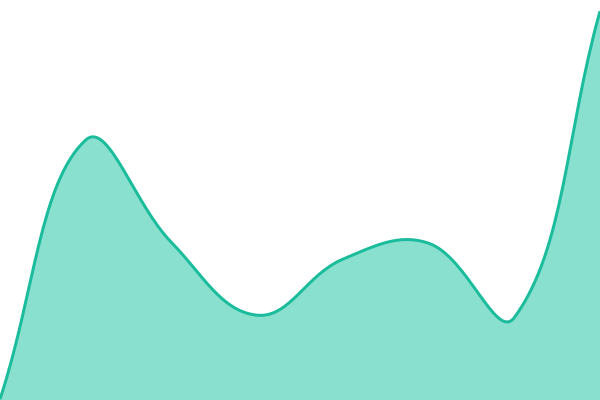
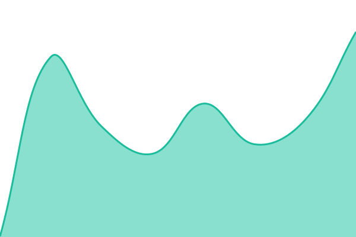
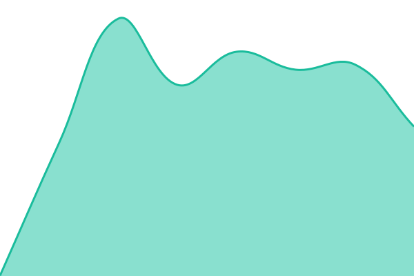

# [📈 Live Status](https://status.ndsg-check.ch): <!--live status--> **Alle Systeme laufen**

This repository contains the open-source uptime monitor and status page for [mike-kd2](https://status.ndsg-check.ch), powered by [Upptime](https://github.com/upptime/upptime).

With [Upptime](https://upptime.js.org), you can get your own unlimited and free uptime monitor and status page, powered entirely by a GitHub repository. We use [Issues](https://github.com/mike-kd2/upptime/issues) as incident reports, [Actions](https://github.com/mike-kd2/upptime/actions) as uptime monitors, and [Pages](https://status.ndsg-check.ch) for the status page.

<!--start: status pages-->
<!-- This summary is generated by Upptime (https://github.com/upptime/upptime) -->
<!-- Do not edit this manually, your changes will be overwritten -->
<!-- prettier-ignore -->
| URL | Status | History | Response Time | Uptime |
| --- | ------ | ------- | ------------- | ------ |
|  [ndsg-check.ch](https://ndsg-check.ch) | 🟩 Up | [ndsg-check-ch.yml](https://github.com/mike-kd2/upptime/commits/HEAD/history/ndsg-check-ch.yml) | 

 208ms
     
 | 

<a href="https://mike-kd2.github.io/upptime/history/ndsg-check-ch">100.00%</a>
    

|  [Glossar](https://ndsg-check.ch/glossar) | 🟩 Up | [glossar.yml](https://github.com/mike-kd2/upptime/commits/HEAD/history/glossar.yml) | 

 188ms
     
 | 

<a href="https://mike-kd2.github.io/upptime/history/glossar">100.00%</a>
    

|  [Scan Worker](https://scan.ndsg-check.ch/health) | 🟩 Up | [scan-worker.yml](https://github.com/mike-kd2/upptime/commits/HEAD/history/scan-worker.yml) | 

 609ms
     
 | 

<a href="https://mike-kd2.github.io/upptime/history/scan-worker">100.00%</a>
    

<!--end: status pages-->

[**Visit our status website →**](https://status.ndsg-check.ch)

## 📄 License

- Powered by: [Upptime](https://github.com/upptime/upptime)
- Code: [MIT](./LICENSE) © [Anand Chowdhary](https://anandchowdhary.com), supported by [Pabio](https://pabio.com)
- Data in the `./history` directory: [Open Database License](https://opendatacommons.org/licenses/odbl/1-0/)
